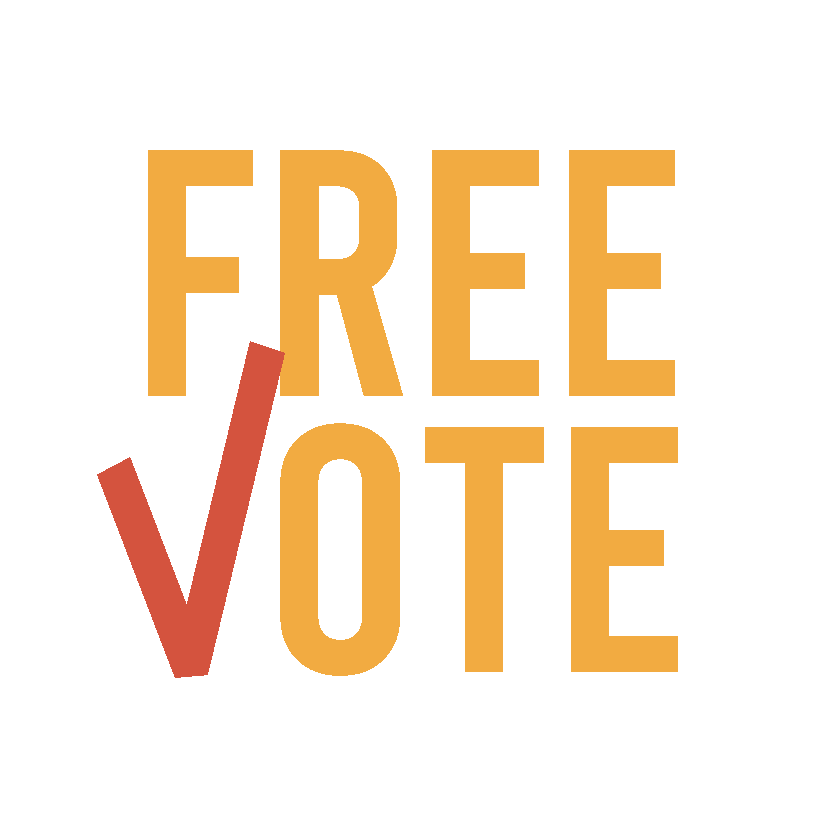

  

 

Project for the Web Software Technologies course of Computer Science faculty. Academic year 2020/2021 [University of Salerno, Italy][1].

# Project Description 

FreeVote is an online platform that enables voting for political elections/referendums in a particular country. 
It allows users to access information about the programs of various political parties, their history, and the resumes of their candidates. 
Additionally, the platform provides the ability to observe various statistics regarding ongoing elections. 
The idea stems from the desire to promote the exercise of the right to vote in adverse circumstances and facilitate those who are unable to physically reach polling stations.

## Authors

* **Sabato Bene**       - [Harley-ux](https://github.com/Harley-ux)
* **Lidia Cozzolino**       - [lcozz](https://github.com/lcozz)
* **Riccardo Napoli**       - [rnapoli00](https://github.com/rnapoli00)
* **Alessandro Penna**      - [a-penna](https://github.com/a-penna)

[1] : Being a project for the University of Salerno, all the documentation is written in italian.
